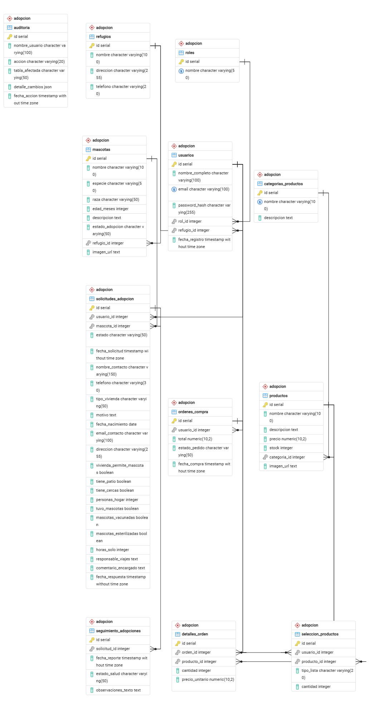
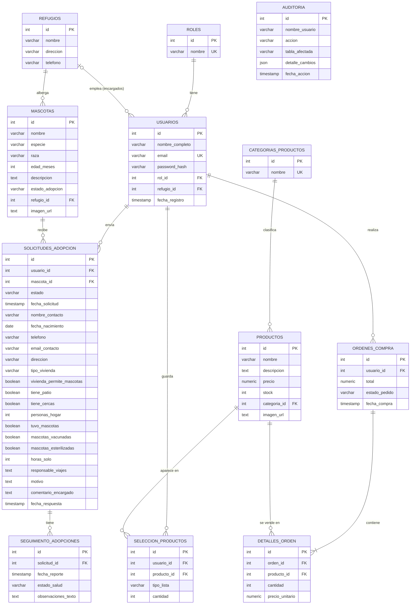

# Base de datos — Paws&Shop

Motor: PostgreSQL · Esquema: `adopcion` · 12 tablas
El esquema completo está en [`schema.sql`](../schema.sql).

## 1. Diagrama entidad-relación

`AUDITORIA` no tiene relaciones: es un registro histórico independiente.

## 2. Reglas de integridad (CHECK)

| Tabla.columna | Valores permitidos |
|---|---|
| mascotas.estado_adopcion | Disponible, En Proceso, Adoptada |
| solicitudes_adopcion.estado | En Revisión, Aprobada, Rechazada, Entregada, En Seguimiento, Cerrada |
| ordenes_compra.estado_pedido | Pendiente, Pagada, Enviada, Entregada |
| seguimiento_adopciones.estado_salud | Excelente, Bueno, Regular, Malo |

Índices para las búsquedas del catálogo y la tienda: `idx_mascotas_estado`, `idx_mascotas_edad`,
`idx_mascotas_refugio`, `idx_productos_categoria`, `idx_productos_nombre`, `idx_productos_precio`.

## 3. Normalización

### Primera forma normal (1FN)
- Todas las columnas guardan **un solo valor atómico**: la edad es un entero en meses
  (`edad_meses`), no un texto como "2 años y 3 meses".
- Cada tabla tiene clave primaria (`id`) y no hay grupos repetidos. Los productos de un pedido
  no están en columnas `producto1, producto2…`: van en filas de `detalles_orden`.
- Excepción consciente: `auditoria.detalle_cambios` es JSON porque guarda una foto de lo que
  cambió, con forma variable según la tabla. No se consulta por campos internos.

### Segunda forma normal (2FN)
- Todas las tablas usan clave primaria simple (`id`), así que no puede haber dependencias
  parciales de una clave compuesta.
- En `detalles_orden`, el par (`orden_id`, `producto_id`) identifica la línea, y `cantidad` y
  `precio_unitario` dependen de esa línea completa, no de una sola de las dos.

### Tercera forma normal (3FN)
Se eliminaron las dependencias transitivas separando las entidades:
- El nombre del rol vive en `roles`; `usuarios` solo guarda `rol_id`.
- Los datos del refugio (dirección, teléfono) viven en `refugios`, no repetidos en cada mascota.
- El nombre de la categoría vive en `categorias_productos`, no repetido en cada producto.
- Los datos de un producto no se copian en `seleccion_productos` ni en `detalles_orden`:
  se llega a ellos por `producto_id`.

### Decisiones de desnormalización controlada
| Dato | Por qué se guarda así |
|---|---|
| `detalles_orden.precio_unitario` | Es el precio **al momento de la compra**. Si el precio del producto cambia después, el pedido antiguo no debe cambiar. |
| `ordenes_compra.total` | Se puede calcular sumando `detalles_orden`, pero se guarda para consultas y reportes rápidos. Se escribe una sola vez, dentro de la misma transacción que crea el pedido. |
| `auditoria.nombre_usuario` | Se copia el nombre en vez de apuntar a `usuarios`, para que el registro sobreviva aunque se elimine al usuario. |
| `solicitudes_adopcion.nombre_contacto`, `telefono`, `email_contacto`, `direccion` y `fecha_nacimiento` | Son los datos que el adoptante declaró **en esa solicitud**, no necesariamente los de su perfil (pueden cambiar con el tiempo, por eso se guardan como una foto del momento y no dependen de `usuarios`). El resto de respuestas del formulario describen la vivienda y el hogar en ese momento. |
| `solicitudes_adopcion.comentario_encargado` y `fecha_respuesta` | Dependen solo de la solicitud (su clave primaria), así que no rompen la 2FN ni la 3FN. || Son los datos que el adoptante declaró **en esa solicitud**, no necesariamente los de su perfil. |
| Estados como texto con CHECK | Con 3 a 6 valores fijos, un CHECK es más simple que una tabla de catálogo y la base igual rechaza valores inválidos. |

Fuera de estas excepciones documentadas, el modelo cumple 3FN.

## 4. Integridad referencial y borrado

Todas las relaciones tienen clave foránea. La aplicación aplica estas reglas al eliminar:
- Una mascota con solicitudes no se elimina (solo el admin puede forzarlo, y entonces se borran
  también sus solicitudes y seguimientos).
- Un producto con pedidos no se elimina.
- Un refugio con mascotas o usuarios asignados no se elimina.