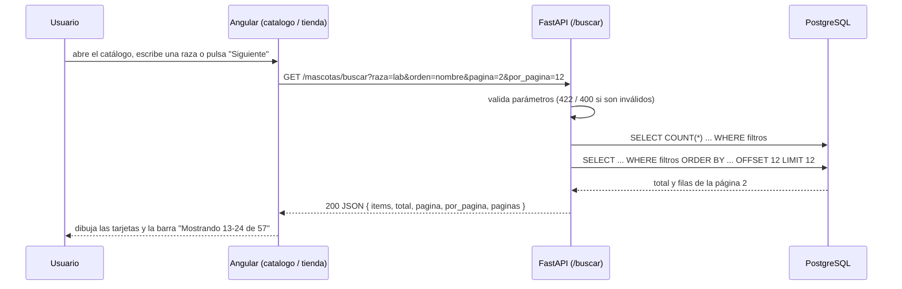

# Protocolo de comunicación de la paginación

Explica **cómo se hablan Angular y la API** cuando el catálogo de mascotas y la tienda
muestran los resultados por páginas. Se aplica a dos recursos con el mismo contrato:

| Recurso | Endpoint | Pantalla Angular |
|---|---|---|
| Mascotas | `GET /mascotas/buscar` | `catalogo.component.ts` |
| Productos | `GET /productos/buscar` | `tienda.component.ts` |

## 1. Idea general

La paginación es **del lado del servidor**: la API nunca devuelve todos los registros,
solo **un bloque** (por defecto 12) más los datos necesarios para dibujar la barra de páginas.
Así la pantalla sigue siendo rápida aunque haya miles de mascotas o productos, y los filtros
se ejecutan en PostgreSQL (con `WHERE`, `ORDER BY`, `OFFSET` y `LIMIT`), no en el navegador.



## 2. La petición (Angular → API)

Método `GET` con los datos en la **query string**. Todos son opcionales.

**Parámetros comunes**

| Parámetro | Tipo | Defecto | Regla |
|---|---|---|---|
| `pagina` | entero | `1` | mínimo 1 |
| `por_pagina` | entero | `12` | de 1 a **50** (evita pedir todo de golpe) |
| `orden` | texto | `recientes` | solo valores permitidos (ver abajo) |

**Filtros de `/mascotas/buscar`:** `raza` (contiene), `especie` (exacta), `estado` (exacto),
`edad_min` y `edad_max` (en **meses**). `orden`: `recientes`, `nombre`, `edad_asc`, `edad_desc`.

**Filtros de `/productos/buscar`:** `q` (texto en el nombre), `categoria_id`, `precio_min`,
`precio_max`, `solo_con_stock`. `orden`: `recientes`, `precio_asc`, `precio_desc`, `nombre`.

Ejemplo:

```
GET http://localhost:8000/productos/buscar?q=alimento&precio_max=50000&orden=precio_asc&pagina=2&por_pagina=12
```

## 3. La respuesta (API → Angular)

Siempre el mismo sobre JSON, con código **200**:

```json
{
  "items":      [ { "id": 7, "nombre": "Luna", "...": "..." } ],
  "total":      57,
  "pagina":     2,
  "por_pagina": 12,
  "paginas":    5
}
```

| Campo | Significado |
|---|---|
| `items` | Los registros de **esta** página (puede estar vacío) |
| `total` | Cuántos registros cumplen los filtros en **todas** las páginas |
| `pagina` | Página que se devolvió |
| `por_pagina` | Tamaño de página aplicado |
| `paginas` | `ceil(total / por_pagina)`, mínimo 1 |

En Angular este sobre es la interfaz genérica `Pagina<T>` (`models/modelos.ts`):
`this.http.get<Pagina<Mascota>>(...)`.

## 4. Errores y casos límite

| Situación | Respuesta de la API | Qué hace Angular |
|---|---|---|
| `pagina=0`, `por_pagina=500`, `orden=xyz` | **422** (validación de FastAPI) | muestra un mensaje de error |
| `edad_min > edad_max` o `precio_min > precio_max` | **400** con `detail` en español | muestra el `detail` |
| Filtros sin coincidencias | **200** con `items: []` y `total: 0` | muestra "No se encontraron resultados" |
| Página mayor que `paginas` | **200** con `items: []` | la barra sigue mostrando las páginas reales para volver |
| Backend apagado | sin respuesta (`status 0`) | "No se pudo conectar con el servidor" |

Orden fijo dentro de cada resultado: en mascotas van primero las **Disponibles**, luego las
**En Proceso** y al final las **Adoptadas**; en productos los **agotados** siempre al final.
Después se aplica el orden elegido por el usuario.

## 5. Cómo lo usa Angular

1. **Estado en signals:** `pagina`, `paginas`, `total` y cada filtro son `signal(...)`.
2. **Cualquier cambio de filtro vuelve a la página 1** (`reiniciarYBuscar()`); si no, el usuario
   podría quedar en la página 5 de un resultado que ahora solo tiene 2.
3. **Espera al escribir (debounce):** los campos de texto esperan 350-400 ms después de la
   última tecla antes de llamar a la API, para no hacer una petición por letra.
4. **Cancela la petición anterior:** si el usuario cambia un filtro mientras otra búsqueda sigue
   en curso, se hace `unsubscribe()` de la vieja; así una respuesta lenta nunca pisa a una nueva.
5. **Barra de páginas reutilizable:** `<app-paginacion [pagina] [paginas] [total] [porPagina] (cambiar)>`
   solo dibuja los botones y avisa con el evento `cambiar(n)`; la pantalla decide qué hacer.
   Muestra "Mostrando 13-24 de 57" usando `total` y `por_pagina`.
6. Al cambiar de página se sube al inicio con `window.scrollTo`.

## 6. Por qué `OFFSET/LIMIT`

Es la técnica más sencilla y suficiente para el tamaño de este proyecto: la página `n`
empieza en el registro `(n - 1) * por_pagina`. Si el catálogo llegara a tener cientos de miles
de filas, se podría cambiar por paginación con cursor (`WHERE id < último_id`) sin tocar la forma
de la respuesta que ve Angular.
